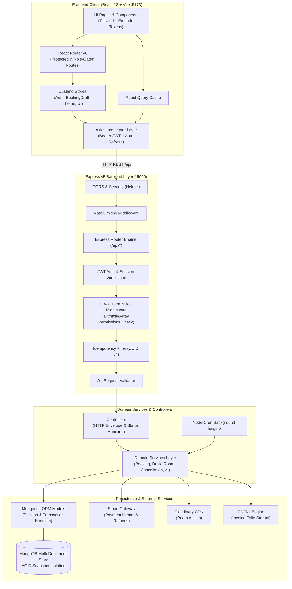

# System Architecture — Hotel Management System

**Generated:** 2026-09-29  
**Scope:** Architectural patterns, PBAC security models, concurrency guards, and data flow topologies.

---

## 1. High-Level System Topology



---

## 2. Layer Breakdown & Design Patterns

### 1. Presentation & Routing Layer
- **Layout Segregation:**
  - `GuestLayout`: High-touch luxury aesthetic for guests (Navbar, hero showcase, room catalog, booking review).
  - `StaffLayout`: Dense, high-efficiency cockpit for front desk receptionists, managers, and housekeepers.
- **Client Route Guards:**
  - `ProtectedRoute`: Verifies active session token in `useAuthStore`.
  - `PermissionRoute`: Compares user permissions against required capability before mounting cockpit components.

### 2. Controller-Service-Repository Pattern
- **Controllers (`backend/src/controllers/`):**
  - Sole responsibility: parse HTTP request payloads, invoke service layer methods, and format responses using standardized `ApiResponse` and `ApiError` utilities.
- **Domain Services (`backend/src/services/`):**
  - Encapsulate 100% of hotel business rules: rate calculations, seasonal tax adjustments, loyalty point deductions, and status transition workflows.
  - Zero coupling to Express request/response objects, ensuring full unit testability.
- **Models (`backend/src/models/`):**
  - Mongoose schemas with pre-save validation hooks, compound indexes, and static query helpers.

---

## 3. Security Architecture: PBAC & RBAC

The system employs a dual-layer security model combining high-level roles with fine-grained Permission-Based Access Control (PBAC):

### Roles
- `SUPER_ADMIN`: Unrestricted master privileges across all hotel operations.
- `ADMIN`: Full administrative control over rooms, staff accounts, and financial reports.
- `MANAGER`: Front-desk oversight, discount authorizations, and audit viewing.
- `RECEPTIONIST`: Check-in, check-out, key issuance, and folio settlements.
- `HOUSEKEEPING`: Room clean/dirty state toggle and maintenance defect logging.
- `GUEST`: Personal booking creation, profile updates, and verified review submissions.

### PBAC Capabilities (`permission.middleware.js`)
```javascript
PERMISSIONS = {
  MANAGE_ROOMS: 'MANAGE_ROOMS',
  VIEW_DESK: 'VIEW_DESK',
  CHECK_IN_GUEST: 'CHECK_IN_GUEST',
  CHECK_OUT_GUEST: 'CHECK_OUT_GUEST',
  OVERRIDE_ROOM_STATUS: 'OVERRIDE_ROOM_STATUS',
  PROCESS_REFUNDS: 'PROCESS_REFUNDS',
  VIEW_ANALYTICS: 'VIEW_ANALYTICS',
  EXPORT_AUDIT_LOGS: 'EXPORT_AUDIT_LOGS',
  MANAGE_STAFF: 'MANAGE_STAFF'
}
```

---

## 4. Concurrency & ACID Booking Isolation

To completely eradicate double-booking hazards during high-traffic flash sales or concurrent check-ins:

1. **MongoDB Session Transactions:**
   - Every booking creation executes within `const session = await mongoose.startSession(); session.startTransaction();`.
2. **Strict Date-Range Overlap Predicate:**
   - A room is considered conflicting if:
     ```javascript
     {
       status: { $in: ['confirmed', 'checked_in', 'pending_payment'] },
       $and: [
         { checkInDate: { $lt: requestedCheckOut } },
         { checkOutDate: { $gt: requestedCheckIn } }
       ]
     }
     ```
3. **Idempotency Guard (`idempotency.middleware.js`):**
   - Client sends unique `X-Idempotency-Key` (UUIDv4) with each payment and booking request.
   - If key exists in `IdempotencyKey` collection, cached response is returned immediately, preventing duplicate card charges.
