# Technical Architecture Plan: Audit Log Payment Inspector & Manager Analytics Payment ID Search

**Feature Name:** `audit-payment-inspector-and-analytics-search`  
**Related Spec:** [.specify/specs/audit-payment-inspector-and-analytics-search/spec.md](file:///c:/Users/hamih/OneDrive/Desktop/AtoZ%20Coder/Advanced%20MERN/Hotel-Management-System/.specify/specs/audit-payment-inspector-and-analytics-search/spec.md)  
**Status:** Architecture Blueprint (Ready for Tasks & Implementation)  
**Priority:** High (P1)  
**Target Subsystems:**
- `backend` (Express, Mongoose: `analytics.routes.js`, `analytics.controller.js`, `desk.service.js`)
- `frontend` (React + Vite + Material UI: `AuditPayloadModal.jsx`, `AdminAnalyticsPage.jsx`, `admin.service.js`)

---

## 1. System Architecture & Request Lifecycle

```mermaid
sequenceDiagram
    autonumber
    actor Manager as Hotel Manager / Auditor
    participant UI as Manager Analytics / Audit Trail Modal
    participant Router as Express Analytics Router (/api/v1/admin/analytics)
    participant Auth as Auth & Permission Middleware
    participant Controller as AnalyticsController.searchPayment
    participant DB as MongoDB (Payment, Booking, User, AuditLog)

    rect rgb(20, 30, 45)
        note right of UI: Flow A: Manager Analytics Payment ID Search
        Manager->>UI: Enters Payment ID (6aba...) or Booking Ref (GH-...) in Analytics Search Bar
        UI->>Router: GET /api/v1/admin/analytics/payments/search?query=...
        Router->>Auth: authenticate + requirePermission('analytics:view')
        Auth-->>Router: Authorized
        Router->>Controller: searchPayment(req, res, next)
        Controller->>DB: Query Payment by _id, transactionReference, or bookingId
        Controller->>DB: Populate userId (Guest), receivedByStaffId (Staff), bookingId (Rooms & Dates)
        Controller->>DB: Query AuditLog for events where targetId = payment._id or bookingId
        Controller-->>UI: 200 OK { payment, auditLogs }
        UI-->>Manager: Displays Transaction Hero Card, Payer/Receiver breakdown, & Audit Timeline
    end

    rect rgb(25, 40, 35)
        note right of UI: Flow B: Audit Log Payload Inspector for Payment Events
        Manager->>UI: Clicks "Inspect" on payment:record-cash / payment:record-card event
        UI->>UI: Evaluates targetType === 'Payment' or action starts with 'payment:'
        UI->>UI: Formats Hero Banner (Amount, Currency, Status, Method)
        UI->>UI: Renders Payer Card (Guest Name, Phone, Email)
        UI->>UI: Renders Receiver Card (Staff Name, Role Badge, Staff Email)
        UI->>UI: Renders Linked Booking (Booking Ref, Suites, Dates)
    end
```



---

## 2. API Contract Specification

### 2.1 Endpoint: `GET /api/v1/admin/analytics/payments/search`
- **Security Middlewares:**
  1. `authenticate` (JWT verification)
  2. `requirePermission(PERMISSIONS.ANALYTICS_VIEW)`
- **Query Parameters:**
  - `query`: String (MongoDB ObjectId `_id`, Booking Reference string `GH-XXXXX` / `BK-XXXXX`, or POS `transactionReference`).
- **Response Format (200 OK):**
```json
{
  "success": true,
  "message": "Payment audit details retrieved successfully",
  "data": {
    "payment": {
      "_id": "6aba6aed171e374120f238af",
      "amount": 250,
      "currency": "USD",
      "paymentMethod": "cash",
      "status": "completed",
      "createdAt": "2026-09-28T13:14:05.000Z",
      "transactionReference": "POS-8491",
      "notes": "Cash collected at desk",
      "user": {
        "_id": "66f543210987654321098766",
        "name": "Ahmed Khan",
        "email": "ahmed.khan@example.com",
        "phone": "+923001234567"
      },
      "receivedByStaff": {
        "_id": "6aba6aed171e374120f238a5",
        "name": "Sara Receptionist",
        "email": "sara@grandhorizon.com",
        "role": "receptionist"
      },
      "booking": {
        "_id": "66f543210987654321098765",
        "bookingReference": "GH-84729",
        "status": "checked-in",
        "checkInDate": "2026-09-28T00:00:00.000Z",
        "checkOutDate": "2026-09-30T00:00:00.000Z",
        "totalPrice": 250,
        "paidAmount": 250,
        "rooms": [
          {
            "roomNumber": "204",
            "type": "deluxe"
          }
        ]
      }
    },
    "auditLogs": [
      {
        "_id": "6aba6aed171e374120f238b1",
        "action": "payment:record-cash",
        "actorId": { "name": "Sara Receptionist", "email": "sara@grandhorizon.com", "role": "receptionist" },
        "createdAt": "2026-09-28T13:14:05.000Z",
        "ipAddress": "127.0.0.1"
      }
    ]
  }
}
```

---

## 3. Component Architecture & UI Strategy

### 3.1 Security Audit Modal (`AuditPayloadModal.jsx`)
- **Target Entity Card (`targetInfo`):**
  - Detect `log.targetType === 'Payment'`.
  - Derive amount: `log.afterState?.amount || log.beforeState?.amount`.
  - Format role/badge: `log.afterState?.paymentMethod?.toUpperCase() || 'PAYMENT'`.
  - Set emerald green theme: `{ bg: 'rgba(62, 207, 142, 0.15)', border: 'rgba(62, 207, 142, 0.35)', text: '#3ECF8E' }`.
- **Friendly Summary Engine:**
  - Check `isPaymentAction = log.targetType === 'Payment' || log.action?.startsWith('payment:') || log.action === 'desk:walk-in-booking'`.
  - Render dedicated **Financial Transaction Summary Hero**:
    - Amount & Currency badge
    - Status pill & Provider
    - Payer details ("Kisne Pay Ki"): Guest Name, Phone, Email
    - Receiver details ("Kisne Receive Ki"): Staff Name, Staff Role badge, Staff Email
    - Booking Reference, Suite numbers, Stay duration
    - Transaction notes / POS slip number

### 3.2 Manager Analytics Page (`AdminAnalyticsPage.jsx`)
- Add **Payment Transaction Search & Audit Console**:
  - Search text input with icon and submit button.
  - Quick example chips ("Search by Payment ID", "Search by Booking Ref").
  - On submit: call `adminService.searchPayment(query)`.
  - If found:
    - Display Transaction Details Hero Card with Payer & Receiver breakdown.
    - Display Associated Audit Trail Timeline showing all mutation events.
  - If not found: Display friendly alert without page disruption.

---

## 4. Implementation Work Packages

| Package | Files | Core Responsibilities |
| :--- | :--- | :--- |
| **WP1: Backend Search API & Controller** | `backend/src/controllers/analytics.controller.js`, `backend/src/routes/analytics.routes.js` | Implement `searchPayment` endpoint querying Payment by ID, reference, or booking reference, populating relations, and fetching linked audit records. |
| **WP2: Backend Desk Service Audit Enrichment** | `backend/src/services/desk.service.js` | Enrich `AuditService.logAction` in `recordInPersonPayment` to store `guestName`, `guestPhone`, `receivedByStaffName`, `receivedByStaffRole`, and currency in `afterState`. |
| **WP3: Frontend Admin Service** | `frontend/src/services/admin.service.js` | Add `searchPayment(query)` API client method. |
| **WP4: Audit Log Payment Inspector UI** | `frontend/src/components/admin/AuditPayloadModal.jsx` | Implement rich non-coder friendly Financial Summary card for payment actions with Payer, Receiver, Amount, and Booking details. |
| **WP5: Manager Analytics Search Console UI** | `frontend/src/pages/admin/AdminAnalyticsPage.jsx` | Add Payment Transaction Search section with input, loading state, result hero card, and audit timeline. |
| **WP6: Build & Test Verification** | Entire project | Compile with `npm run build` and verify end-to-end integration. |
