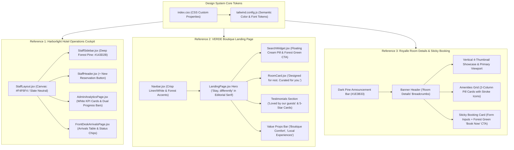
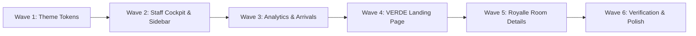

# Technical Architecture Plan: Emerald & Linen Luxury Hotel Design System (Verde & Harborlight)

**Feature Name:** `emerald-luxury-hotel-design-system`  
**Related Spec:** [.specify/specs/emerald-luxury-hotel-design-system/spec.md](file:///c:/Users/hamih/OneDrive/Desktop/AtoZ%20Coder/Advanced%20MERN/Hotel-Management-System/.specify/specs/emerald-luxury-hotel-design-system/spec.md)  
**Status:** Completed ✅  
**Priority:** High (P1)  
**Target Subsystems:**
- `frontend/tailwind.config.js` (Design tokens, palette extensions, serif typography)
- `frontend/src/index.css` (CSS variables, dynamic light/dark tokens, custom scrollbars)
- `frontend/src/layouts/` (`StaffLayout.jsx`, `GuestLayout.jsx`)
- `frontend/src/components/staff/` (`StaffSidebar.jsx`, `StaffHeader.jsx`)
- `frontend/src/components/guest/` (`Navbar.jsx`, `SearchWidget.jsx`, `RoomCard.jsx`)
- `frontend/src/pages/` (`LandingPage.jsx`, `RoomDetailPage.jsx`, `AdminAnalyticsPage.jsx`, `FrontDeskArrivalsPage.jsx`)

---

## 1. System & Visual Architecture Overview



---

## 2. Token Architecture & Variable Specifications

### 2.1 CSS Custom Properties (`frontend/src/index.css`)

The tokens are structured to provide seamless theme adaptation:
- **Default / Light Mode:** Warm natural linen canvas (`#FBF8F2` / `#F4F6F4`), crisp pure white surfaces (`#FFFFFF`), deep forest green identity (`#143D2B`), and warm camel-gold accents (`#C19A5B`).
- **Dark Mode:** Deep pine obsidian canvas (`#0D1B14`), elevated dark emerald surfaces (`#132A1F`), high-contrast sage text (`#E8EFEA`), and gold highlights.

```css
:root,
html.light {
  /* Canvas & Surfaces */
  --ink: #FBF8F2;               /* VERDE Warm Linen Canvas */
  --canvas-ops: #F4F6F4;        /* Harborlight Operations Canvas */
  --surface: #FFFFFF;           /* Crisp White Card Surface */
  --surface-2: #F5EFE6;         /* Elevated Cream Surface / Pill Background */
  --surface-muted: #EFE9DF;     /* Muted Tan Input Background */
  --border: #E3EAE5;            /* Soft Sage-Slate Border */
  --border-subtle: #ECE5DA;     /* Warm Linen Border */

  /* Forest Green Brand Identity */
  --forest-primary: #143D2B;    /* Harborlight Primary Green */
  --forest-deep: #0E281C;       /* Dark Pine Announcement / Hero Overlay */
  --forest-hover: #1C523B;      /* Interactive Green Hover */
  --forest-accent: #1E392A;     /* VERDE Olive Forest CTA */
  --forest-light: #EAF2ED;      /* Soft Forest Pill Background */

  /* Text & Neutrals */
  --text: #1A2421;              /* High-Contrast Editorial Charcoal/Forest */
  --text-body: #4A5550;         /* Highly Legible Body Neutral */
  --text-muted: #7C8B84;        /* Secondary Meta & Spec Text */

  /* Luxury Accents */
  --gold: #C19A5B;              /* Warm Camel / Luxury Gold */
  --gold-hover: #AF8849;
  --gold-light: #F7F1E6;

  /* Status Colors (Harborlight Style) */
  --success: #1B7A4E;           /* Confirmed Booking (Forest Sage) */
  --warning: #D9822B;           /* Pending / Tentative (Warm Ochre) */
  --danger: #D9383A;            /* Cancelled / Urgent */

  color-scheme: light;
}

html.dark {
  --ink: #0A140F;               /* Deep Obsidian Pine */
  --canvas-ops: #0E1A14;
  --surface: #14241C;           /* Dark Forest Card */
  --surface-2: #1B3025;
  --surface-muted: #1F382B;
  --border: #264334;
  --border-subtle: #20382B;

  --forest-primary: #2D6A4F;
  --forest-deep: #0E281C;
  --forest-hover: #3E8A66;
  --forest-accent: #255C43;
  --forest-light: #1A3828;

  --text: #E8EFEA;
  --text-body: #A9BCB2;
  --text-muted: #758D80;

  --gold: #D4B07B;
  --gold-hover: #C5A069;
  --gold-light: #2A2518;

  color-scheme: dark;
}
```

### 2.2 Tailwind Configuration Mapping (`frontend/tailwind.config.js`)

```javascript
module.exports = {
  theme: {
    extend: {
      colors: {
        forest: {
          DEFAULT: "var(--forest-primary)",
          deep: "var(--forest-deep)",
          hover: "var(--forest-hover)",
          accent: "var(--forest-accent)",
          light: "var(--forest-light)",
        },
        linen: {
          DEFAULT: "var(--ink)",
          surface: "var(--surface-2)",
          muted: "var(--surface-muted)",
          border: "var(--border-subtle)",
        },
        camel: {
          DEFAULT: "var(--gold)",
          hover: "var(--gold-hover)",
          light: "var(--gold-light)",
        },
      },
      fontFamily: {
        display: ["Fraunces", "serif"],
        body: ["Inter", "sans-serif"],
      },
    },
  },
};
```

---

## 3. Subsystem Implementation Blueprints

### 3.1 Subsystem 1: Staff Operations Cockpit (Harborlight Style)

#### `StaffSidebar.jsx` Blueprint
1. **Container Styling:**
   - Width: `w-64`, Background: `#143D2B` (deep forest pine), border-right `#1B4A35`.
2. **Brand Title Section:**
   - Circular badge: Emerald crest shield icon with subtle gold border.
   - Text: `"GRAND HORIZON"` (uppercase bold, `#FFFFFF`), subtitle `"Reservation Management"` in soft sage text (`#94B5A5`).
3. **Navigation Links (`NavLink`):**
   - Active: `bg-white/10 text-white font-semibold rounded-lg shadow-sm border-l-2 border-[#C19A5B]`.
   - Inactive: `text-[#94B5A5] hover:text-white hover:bg-white/5 rounded-lg`.
   - Dynamic PBAC logic: Retain 100% existing RBAC & PBAC permission filtering without altering logic.
4. **Footer Attribution Card:**
   - Staff avatar circle with warm camel badge (`#C19A5B`), staff name, role tag (`ADMIN`, `RECEPTIONIST`), and logout button.

#### `StaffHeader.jsx` Blueprint
1. **Layout & Canvas:**
   - Background: Pure White (`#FFFFFF`) or soft sage header with subtle bottom border (`#E3EAE5`).
   - Title: `#143D2B` font-semibold, subtitle in `#7C8B84`.
2. **Action Bar:**
   - Current live date/time counter in soft rounded chip (`Aug 5, 2026, 8:43 AM`).
   - Sync refresh button with spinning state on fetch.
   - Primary action button: `+ New Reservation` in `#143D2B` with hover `#1C523B` and crisp white text.

#### `AdminAnalyticsPage.jsx` & `FrontDeskArrivalsPage.jsx` Blueprint
1. **KPI Stat Grid (Harborlight 8-Card Layout):**
   - Pure white card (`#FFFFFF`), border `#E3EAE5`, soft rounded-xl corners.
   - Mini square category icon container with pastel background.
   - Bold metric count (`16`, `13`, `2`, `1`, `₱68,950.00`, `₱54,450.00`, `11`, `3`).
   - Subtext indicators (`1 unavailable for sale`, `13% occupancy`, `1 arrival(s) today`).
2. **Dual-Toned Availability Progress Bars:**
   - Background track: `#E3EAE5`.
   - Primary fill: Forest Green (`#143D2B`) for occupied rooms.
   - Secondary fill: Warm Camel (`#C19A5B`) for reserved/pending rooms.
   - Right-side room fraction label (`2/2`, `1/2`).
3. **Upcoming Arrivals Table:**
   - Clean tabular rows with date chip (`Aug 5`), Guest Name with reservation code, and soft status pill (`Confirmed` in `#1B7A4E`, `Guaranteed` in `#0D9488`, `Pending` in `#D9822B`).

---

### 3.2 Subsystem 2: VERDE Boutique Guest Landing Page

#### `LandingPage.jsx` Blueprint
1. **Hero Section:**
   - Background: Warm natural linen (`#FBF8F2`).
   - Background imagery: Lifestyle hotel bedroom overlooking green forest foliage with natural sunlight.
   - Main Headline: *"Stay, differently"* in `Fraunces` serif font with italicized *"differently"*.
   - Sub-headline: *"BOUTIQUE COMFORT. MEMORABLE MOMENTS."* and location pill badge *"Boutique Hotel Booking Near Me"*.
2. **Floating Booking Search Bar (`SearchWidget.jsx`):**
   - Elevated cream container (`#F5EFE6` or `#FFFFFF` with `#ECE5DA` border and `rounded-2xl` or `rounded-3xl` pill silhouette).
   - Date inputs (`CHECK-IN`, `CHECK-OUT`) with calendar icons.
   - Guests selector (`GUESTS`, `2 Guests`).
   - Primary Action: Deep Forest Olive button (`bg-[#1E392A] hover:bg-[#2A4D39] text-white font-medium tracking-wide uppercase px-8 py-4 rounded-xl`), label: `"CHECK AVAILABILITY"`.
   - Footer Trust Line: *"Best Rate Guarantee | No Booking Fees"*.
3. **Featured Rooms Grid ("Designed for rest. Curated for you."):**
   - Classic serif section header with subtitle.
   - Luxury room cards (`Deluxe Room`, `Garden Room`, `Premium Room`, `Suite Room`) with rounded photo corners, description, and price line (`FROM $129 / NIGHT`).
   - Circular glide arrows on left and right for scrolling.
4. **Guest Reviews ("Loved by our guests"):**
   - 3-column review cards: 5 gold/forest stars, genuine testimonial quote, circular guest avatar, guest name, and location (`New York, USA`, `London, UK`, `Dubai, UAE`).
5. **Value Props Horizontal Strip:**
   - 4 minimalist icons and labels: *Boutique Comfort*, *Prime Locations*, *Local Experiences*, *Safe & Secure*.

---

### 3.3 Subsystem 3: Royalle Room Details & Sticky Booking Card

#### `RoomDetailPage.jsx` Blueprint
1. **Top Announcement Strip:**
   - Height: `h-10`, Background: Dark Pine (`#1E3B33`).
   - Information: Phone number, email, hotel address, and social icons in soft sage/white text.
2. **Navbar:**
   - Crisp white background, hotel logo, navigation links with subtle forest hover, and dark pine `"Book Now"` button.
3. **Hero Title Banner:**
   - Darkened room cover image with breadcrumbs (`Home / Room Details`) and centered serif title `"Room Details"`.
4. **Content Layout (2-Column Grid: Content 65% + Sidebar 35%):**
   - **Main Gallery:** Large hero photo on right + 4 clickable vertical thumbnail previews on left.
   - **Room Header:** Room title in bold serif (`Standard Rooms`), dark teal pill badge (`Luxury Room`), star rating (`★ 4.9 (245 Reviews)`), location, nightly price (`$150 / night`), and spec chips (Bed, Bath, Sqft, Guests, Share button).
   - **Overview Paragraph:** Warm editorial copy.
   - **Room Amenities Grid:** 2-column rounded cards with line icons (`Air Conditioning`, `Flat-Screen TV`, `High-Speed Wi-Fi`, `Electronic Safe`, `Bathtub`, `Seating Area`).
   - **Booking Policies:** Check-in / Check-out bullet points with emerald checkmark markers.
5. **Sticky Booking Sidebar Card:**
   - Fixed position on desktop (`sticky top-28`).
   - Title: Serif font `"Book Room"`.
   - Form inputs: `Your Name`, `Phone Number`, `Check-in Date`, `Check-out Date`, `Adults`, `Children`, `Room Type`, `Number of Rooms`.
   - Clean input borders (`border-[#E3EAE5]` with focus ring in forest green).
   - Submit Button: Full-width dark forest button (`bg-[#1E3B33] text-white py-3.5 rounded-xl font-medium tracking-wide uppercase shadow-md hover:bg-[#254A40]`).

---

## 4. Security, PBAC & Transactional Invariants

1. **Zero-Regression Guarantee:**
   - All role-based access control (RBAC) and permission-based access control (PBAC) logic in `StaffSidebar.jsx` and `Can.jsx` will be preserved without altering permission arrays or security guards.
2. **State & Store Preservation:**
   - `useBookingDraftStore` and `useAuthStore` connections in `SearchWidget.jsx` and `RoomDetailPage.jsx` will remain unchanged.
3. **Stripe & Payment Invariants:**
   - Checkout flows initiated from the sticky booking card or walk-in modals will preserve exact payload parameters (`roomId`, `checkInDate`, `checkOutDate`, `guests`).

---

## 5. Sequential Execution Waves



- **Wave 1:** Update `frontend/tailwind.config.js` and `frontend/src/index.css` with semantic color tokens and font definitions.
- **Wave 2:** Update `StaffLayout.jsx`, `StaffSidebar.jsx`, and `StaffHeader.jsx` to Harborlight forest pine aesthetic.
- **Wave 3:** Re-skin `AdminAnalyticsPage.jsx` and `FrontDeskArrivalsPage.jsx` with Harborlight KPI cards and dual-toned progress bars.
- **Wave 4:** Update `LandingPage.jsx`, `SearchWidget.jsx`, `RoomCard.jsx`, and `Navbar.jsx` to VERDE organic luxury aesthetic.
- **Wave 5:** Update `RoomDetailPage.jsx` to Royalle layout with vertical gallery thumbnails, amenity pill cards, and sticky booking form.
- **Wave 6:** Visual verification, browser check, and zero-regression test.

---

> **Next Step:** Run `/speckit-tasks` to break down this technical plan into an executable, prioritized micro-tasks checklist.
