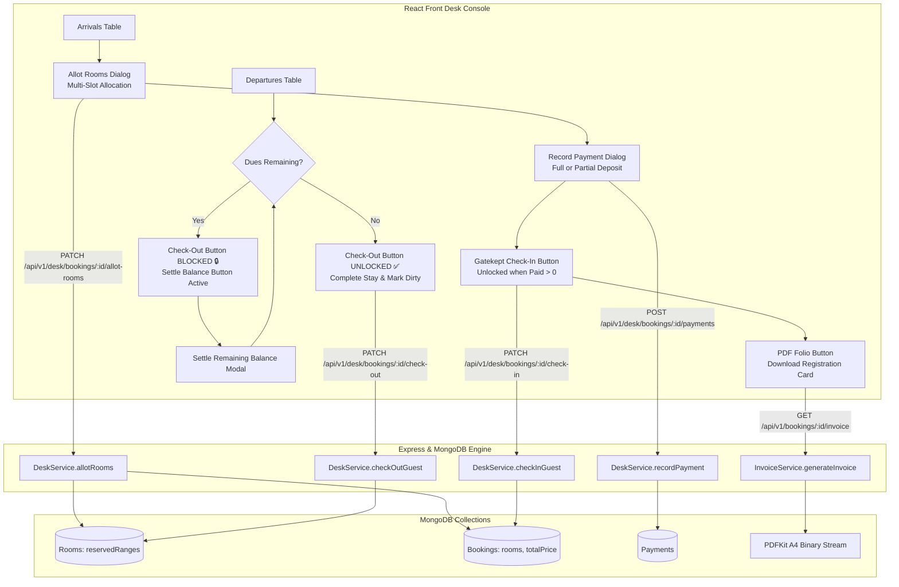

# Technical Architecture Plan: Receptionist-Owned Multi-Room Allotment, Dynamic Pricing, Dual-Gated Settlement & PDF Folio

**Feature Name:** `room-allocation-payment-checkin`  
**Related Spec:** [.specify/specs/room-allocation-payment-checkin/spec.md](file:///c:/Users/hamih/OneDrive/Desktop/AtoZ%20Coder/Advanced%20MERN/Hotel-Management-System/.specify/specs/room-allocation-payment-checkin/spec.md)  
**Status:** Architecture Blueprint (Approved & Implemented)  
**Portal Scope:** **Front Desk Receptionist Portal (`/desk`)** — Guest does not pick physical rooms; Receptionist exercises full operational authority.  
**Target Subsystems:**
- `my-app` (Express / MongoDB Backend: Desk Service, Room Service, Invoice PDF Engine)
- `client` (React / Vite Frontend: Receptionist Front Desk Console, Allotment Modal, POS Payment Modal)

---

## 1. System Architecture Overview



---

## 2. Data Models & Schema Design

### 2.1 Booking Schema (`my-app/src/models/Booking.js`)
The `Booking` model already supports multi-room structures via `rooms: [bookedRoomItemSchema]`.
We will ensure:
- Each item in `rooms` stores `{ roomId, pricePerNight, isAllocated: Boolean }`.
- `totalPrice` / `totalAmount`: Dynamically recomputed upon room allotment:
  $$\text{totalPrice} = \text{nights} \times \sum_{i=1}^{N} \text{rooms}[i].\text{pricePerNight} - \text{discountAmount}$$
- `paymentStatus`: Enum supports `['pending', 'partially-paid', 'completed', 'refunded', 'failed']`.
- `paidAmount`: Number, default `0`. Tracked directly on the booking document for $O(1)$ fast lookups during gatekeeping checks.

### 2.2 Payment Schema (`my-app/src/models/Payment.js`)
- `bookingId`: ObjectId (ref: `Booking`).
- `amount`: Number (> 0).
- `paymentMethod`: Enum `['cash', 'offline-card', 'card', 'stripe']`.
- `paymentType`: Enum `['full', 'partial', 'settlement']`.
- `status`: Enum `['pending', 'completed', 'failed', 'refunded']`.
- `receivedByStaffId`: ObjectId (ref: `User`).

### 2.3 Room Schema (`my-app/src/models/Room.js`)
- `reservedRanges`: Array of `{ checkIn: Date, checkOut: Date, bookingReference: String }`.
- When switching rooms during multi-slot allotment:
  - Atomic `$pull` from old room `reservedRanges`.
  - Atomic `$push` to new room `reservedRanges`.

---

## 3. API Route Specifications & Behavioral Contracts

### Endpoint 1: Multi-Room Allotment
- **Route:** `PATCH /api/v1/desk/bookings/:id/allot-rooms`
- **Security:** `authenticate` + `requirePermission(PERMISSIONS.CHECKIN_MANAGE)`
- **Request Payload:**
  ```json
  {
    "allocations": [
      {
        "slotIndex": 0,
        "allocatedRoomId": "65f1a2b3c4d5e6f7a8b9c0d1",
        "pricingPolicy": "recalculate"
      },
      {
        "slotIndex": 1,
        "allocatedRoomId": "65f1a2b3c4d5e6f7a8b9c0d2",
        "pricingPolicy": "recalculate"
      }
    ]
  }
  ```
- **Execution Logic:**
  1. Validate booking is `confirmed`.
  2. For every allocation:
     - Verify room is active, not deleted, and `housekeepingStatus === 'clean'`.
     - Verify no conflicting active bookings overlap on `[checkInDate, checkOutDate]`.
     - Ensure no two slots in the payload allocate the exact same physical room (`unique room IDs`).
  3. Release reservation ranges for old rooms and lock reservation ranges for new rooms.
  4. Update each `booking.rooms[slotIndex]` with `{ roomId: allocatedRoom._id, pricePerNight: allocatedRoom.pricePerNight }`.
  5. Recalculate `booking.totalPrice = nights * sum(roomPrices) - discountAmount`.
  6. Return updated booking with populated room details and refreshed balance dues.

---

### Endpoint 2: Payment Recording (Partial & Full)
- **Route:** `POST /api/v1/desk/bookings/:id/payments`
- **Security:** `authenticate` + `requireAnyPermission([PERMISSIONS.PAYMENTS_RECORD_CASH, PERMISSIONS.PAYMENTS_RECORD_CARD])`
- **Request Payload:**
  ```json
  {
    "amount": 300,
    "paymentMethod": "cash",
    "paymentType": "partial",
    "transactionReference": "POS-REC-9941",
    "notes": "50% check-in advance deposit"
  }
  ```
- **Execution Logic:**
  1. Create `Payment` record with `status: 'completed'` and `receivedByStaffId: req.user._id`.
  2. Recalculate total completed payments for booking: `totalPaid = sum(completedPayments)`.
  3. Update `booking.paidAmount = totalPaid`.
  4. If `totalPaid >= booking.totalPrice`:
     - Set `booking.paymentStatus = 'completed'`.
  5. Else if `totalPaid > 0`:
     - Set `booking.paymentStatus = 'partially-paid'`.
  6. Log audit action `payment:record-cash` or `payment:record-card`.
  7. Return `{ payment, booking, remainingDues: Math.max(0, booking.totalPrice - totalPaid) }`.

---

### Endpoint 3: Gatekept Check-In
- **Route:** `PATCH /api/v1/desk/bookings/:id/check-in`
- **Security:** `authenticate` + `requirePermission(PERMISSIONS.CHECKIN_MANAGE)`
- **Invariants Enforced:**
  1. Booking status must be `confirmed`.
  2. Every room in `booking.rooms` must have an assigned physical room and be `clean`.
  3. **Financial Invariant (Check-In Gate):**
     $$\text{paidAmount} > 0$$
     *(At least Partial Advance Deposit or Full Payment must be recorded).*
     If `paidAmount === 0`, reject with `400 Bad Request`:
     `"Cannot check in guest without payment settlement. Please record at least a partial deposit or full payment."`
  4. Mutate `status -> 'checked-in'`.
  5. Return updated booking populated with guest and room info.

---

### Endpoint 4: Gatekept Check-Out
- **Route:** `PATCH /api/v1/desk/bookings/:id/check-out`
- **Security:** `authenticate` + `requirePermission(PERMISSIONS.CHECKOUT_MANAGE)`
- **Invariants Enforced:**
  1. Booking status must be `checked-in`.
  2. **Financial Invariant (Check-Out Gate):**
     $$\text{effectiveTotal} - \text{totalPaid} \le 0$$
     *(Zero Outstanding Dues).*
     If `effectiveTotal - totalPaid > 0`, reject with `400 Bad Request`:
     `"Cannot check out guest with outstanding balance. Total: $X, Paid: $Y, Remaining Dues: $Z. Please settle all pending payments before checkout."`
  3. Mutate `status -> 'checked-out'`.
  4. Automatically flip all assigned physical rooms' `housekeepingStatus -> 'dirty'`.
  5. Trigger loyalty points accrual.
  6. Return updated booking.

---

### Endpoint 5: Official PDF Registration Folio & Tax Invoice
- **Route:** `GET /api/v1/bookings/:id/invoice`
- **Stream Engine:** `PDFKit` (A4 standard)
- **Features Rendered:**
  1. **Header:** Grand Horizon logo, hotel address, tax ID, invoice number.
  2. **Guest Profile:** Name, Email, Phone, Booking Reference.
  3. **Stay Timeline:** Check-In Date, Check-Out Date, Duration (Nights), Total Guests.
  4. **Multi-Room Table:**
     - Row for every assigned physical room: `Room #[roomNumber] ([TYPE] SUITE)`.
     - Base Rate / Night ($).
     - Number of nights.
     - Line Total ($).
  5. **Payment History Ledger:**
     - Itemized list of completed payments with date, method (Cash/Card), and reference.
  6. **Settlement Badge:**
     - Green Badge: `PAID IN FULL ($0.00 DUE)`
     - Amber/Orange Badge: `PARTIALLY PAID - OUTSTANDING DUE AT CHECKOUT: $XXX.XX`
  7. **Guest Signature Block:**
     - Guest signature line & check-in agreement disclaimer.
     - Front Desk Officer signature line.

---

## 4. Frontend Architecture & Component Decomposition

```text
client/src/
├── components/
│   └── staff/
│       ├── AllotRoomDialog.jsx        <-- Multi-Slot Room Allocation Modal
│       │                                  (Slot 1, Slot 2... Matching & Alternatives)
│       └── RecordPaymentDialog.jsx     <-- Full vs Partial Payment Settlement Modal
│                                          (Toggle: Full Bill vs Partial Deposit)
└── pages/
    └── desk/
        └── DeskDashboardPage.jsx      <-- Gatekept Arrivals & Departures Console
```

### 4.1 `AllotRoomDialog.jsx` (Multi-Room Support)
- Reads `booking.rooms` array. If booking has 2 rooms, renders:
  - **Slot 1:** Booked as `Deluxe Suite` -> Lists clean Deluxe rooms first, then alternatives.
  - **Slot 2:** Booked as `Deluxe Suite` -> Lists remaining available rooms (preventing duplicate selection).
- Shows live dynamic total preview:
  `"Allocated 2 rooms • Total Rate: $360/night • Stay (3 nights): $1,080"`
- Submits to `PATCH /api/v1/desk/bookings/:id/allot-rooms`.
- On success, guides receptionist: *"Rooms allocated! Proceed to payment collection."*

### 4.2 `RecordPaymentDialog.jsx` (Partial vs Full Toggle)
- Header displays: **Total Accommodation Bill ($X)**, **Already Paid ($Y)**, **Remaining Balance ($Z)**.
- Payment Option Toggle:
  - 🔘 **Full Settlement:** Pre-fills remaining balance ($Z).
  - 🔘 **Partial Deposit:** Allows entering custom deposit amount (e.g., $150 or min 1 night).
- On success, triggers live refresh and unlocks Check-In button.

### 4.3 `DeskDashboardPage.jsx` (State Gates)
- **Arrivals Tab:**
  - If rooms not yet allocated: Button is **`[Allot Rooms]`** (Gold).
  - If rooms allocated & `$0` paid: Check-In button is **`[Check In]` (Disabled / Locked 🔒)**, with **`[Collect Payment]`** button active.
  - If rooms allocated & `paidAmount > 0`: Check-In button is **`[Check In & Issue Keys]` (Enabled / Active Emerald ✅)**.
  - Button to **`[Print PDF Folio]`** is available.
- **Departures Tab:**
  - If guest has remaining dues (`balance > 0`):
    - Check-Out button is **`[Check Out]` (Disabled / Locked 🔒)**.
    - Prominent button **`[Settle Balance ($X)]`** is shown in amber/orange.
  - Once balance is settled:
    - Check-Out button unlocks to **`[Check Out Guest]` (Active Red)**.
    - Final invoice download button displays.

---

## 5. Security & Invariant Audit

| Subsystem | Security / Business Invariant | Enforcement Mechanism |
|---|---|---|
| **PBAC Access** | Only staff with `checkin:manage` can allot rooms & check in | Express `requirePermission(PERMISSIONS.CHECKIN_MANAGE)` |
| **PBAC Payments** | Only staff with `payments:recordCash`/`Card` can record desk money | Express `requireAnyPermission([...])` |
| **Room Concurrency** | Two receptionists cannot allot the same room simultaneously | MongoDB atomic `$findOneAndUpdate` & `$push` on `reservedRanges` |
| **Check-In Gate** | Guest cannot check in with zero payments recorded | Backend check: `booking.paidAmount > 0` |
| **Check-Out Gate** | Guest cannot leave hotel with unpaid dues | Backend check: `effectiveTotal - totalPaid <= 0` |
| **Housekeeping** | Departing room must be sanitized before next guest | Automatic transition `housekeepingStatus = 'dirty'` on check-out |

---

## 6. Testing Strategy

1. **Unit Tests (`tests/unit/`):**
   - Verify `Booking` model recalculates `totalPrice` properly with multiple room items.
   - Verify `Payment` model records `paymentType: 'partial'` and `paymentType: 'full'`.
   - Verify `InvoiceService` formats multi-room PDF table and shows partial payment ledger balance.
2. **Integration Tests (`tests/integration/desk.test.js`):**
   - Test multi-room slot allocation (`allot-rooms`).
   - Test that check-in fails with 400 when `paidAmount === 0`.
   - Test that check-in succeeds after partial payment is recorded.
   - Test that check-out fails with 400 when partial balance remains unpaid.
   - Test that check-out succeeds once remaining balance is paid.
3. **Frontend Build & End-to-End Verification:**
   - Verify `npm run build` runs clean with 0 bundle errors.

---

## 7. Next Steps
Run `/speckit-tasks` to generate the prioritized, actionable micro-tasks checklist.
