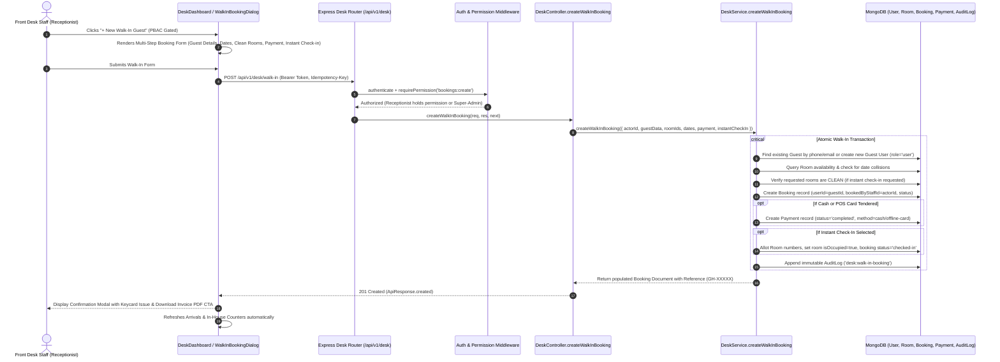

# Technical Architecture Plan: Walk-In Guest Reservation Flow (Front Desk & PBAC Gated)

**Feature Name:** `walk-in-guest-reservation-flow`  
**Related Spec:** [.specify/specs/walk-in-guest-reservation-flow/spec.md](file:///c:/Users/hamih/OneDrive/Desktop/AtoZ%20Coder/Advanced%20MERN/Hotel-Management-System/.specify/specs/walk-in-guest-reservation-flow/spec.md)  
**Status:** Architecture Blueprint (Draft / Ready for Tasks)  
**Priority:** High (P1)  
**Target Subsystems:**
- `frontend` (React + Vite + Material UI: `StaffSidebar.jsx`, `DeskDashboardPage.jsx`, `WalkInBookingDialog.jsx`, `WalkInBookingPage.jsx`, `App.jsx`, `desk.service.js`)
- `backend` (Node.js + Express + Mongoose: `desk.routes.js`, `desk.controller.js`, `desk.service.js`, `desk.validation.js`, `AuditService.js`)

---

## 1. System Architecture Overview & Request Lifecycle



---

## 2. API Contract & Validation Specification

### 2.1 Route Definition
- **Method & Path:** `POST /api/v1/desk/walk-in`
- **Security Middlewares:**
  1. `authenticate` (JWT verification)
  2. `requirePermission(PERMISSIONS.BOOKINGS_CREATE)` (PBAC gate: `bookings:create`)
  3. `validate(createWalkInBookingSchema)` (Joi payload sanitization)

### 2.2 Request Body Schema (`desk.validation.js`)
```javascript
const createWalkInBookingSchema = {
  body: Joi.object({
    // Guest Identification
    guestName: Joi.string().trim().min(2).max(100).required().messages({
      'any.required': 'Walk-in guest full name is required',
    }),
    guestPhone: Joi.string().trim().min(7).max(20).required().messages({
      'any.required': 'Walk-in guest contact phone number is required',
    }),
    guestEmail: Joi.string().email().trim().lowercase().allow('', null).optional(),
    guestIdDocument: Joi.string().trim().max(50).allow('', null).optional(),

    // Suite & Dates Selection
    roomIds: Joi.array()
      .items(Joi.string().pattern(/^[0-9a-fA-F]{24}$/))
      .min(1)
      .required()
      .messages({
        'any.required': 'At least one valid room must be selected for walk-in booking',
      }),
    checkInDate: Joi.date().iso().required(),
    checkOutDate: Joi.date().iso().greater(Joi.ref('checkInDate')).required().messages({
      'date.greater': 'Check-out date must be after check-in date',
    }),
    numberOfGuests: Joi.number().integer().min(1).default(1),
    specialRequests: Joi.string().trim().max(1000).allow('', null).optional(),

    // Payment & Front Desk Disposition
    paymentMethod: Joi.string()
      .valid('cash', 'offline-card', 'pay_later')
      .default('cash'),
    paymentAmount: Joi.number().min(0).optional(),
    instantCheckIn: Joi.boolean().default(true),
  }),
};
```

### 2.3 Response Structure (201 Created)
```json
{
  "success": true,
  "message": "Walk-in reservation created and checked in successfully",
  "data": {
    "booking": {
      "_id": "66f543210987654321098765",
      "bookingReference": "GH-84729",
      "status": "checked-in",
      "paymentStatus": "completed",
      "userId": {
        "_id": "66f543210987654321098766",
        "name": "Ahmed Khan",
        "email": "ahmed.khan@example.com",
        "phone": "+923001234567"
      },
      "bookedByStaffId": "66f111222333444555666777",
      "rooms": [
        {
          "roomId": "66f888999000111222333444",
          "roomNumber": "204",
          "type": "deluxe",
          "pricePerNight": 180
        }
      ],
      "checkInDate": "2026-09-28T00:00:00.000Z",
      "checkOutDate": "2026-09-30T00:00:00.000Z",
      "totalNights": 2,
      "totalAmount": 360,
      "amountPaid": 360,
      "actualCheckInTime": "2026-09-28T13:10:00.000Z"
    }
  }
}
```

---

## 3. Database & Entity Integration Strategy

### 3.1 Guest User Resolution & Auto-Provisioning
When a walk-in guest arrives at the desk:
1. Search MongoDB for existing user matching `phone` or `email`:
   ```javascript
   let guest = await User.findOne({
     $or: [
       ...(guestEmail ? [{ email: guestEmail.toLowerCase() }] : []),
       { phone: guestPhone },
     ],
   });
   ```
2. If no user matches, atomically create a guest record:
   - `name: guestName`
   - `email: guestEmail || \`walkin_\${Date.now()}_\${Math.random().toString(36).slice(2, 6)}@guest.grandhorizon.com\``
   - `phone: guestPhone`
   - `role: ROLES.GUEST`
   - `isWalkIn: true`
   - `password: await bcrypt.hash(crypto.randomBytes(16).toString('hex'), 10)`
   - `isEmailVerified: true` (walk-in guests authenticated in-person by staff)

### 3.2 Concurrency Lock & Room Collision Prevention
- Reuse the strict date-range overlap validation from `booking.service.js`:
  ```javascript
  const overlappingBookings = await Booking.find({
    'rooms.roomId': { $in: roomIds },
    status: { $nin: [BOOKING_STATUS.CANCELLED, BOOKING_STATUS.COMPLETED] },
    checkInDate: { $lt: new Date(checkOutDate) },
    checkOutDate: { $gt: new Date(checkInDate) },
  });
  if (overlappingBookings.length > 0) {
    throw new ApiError(409, 'One or more selected rooms are already booked for the specified dates.');
  }
  ```
- If `instantCheckIn === true`, verify that the room's current housekeeping status is `HOUSEKEEPING_STATUS.CLEAN` and `isOccupied === false`.

---

## 4. Frontend Component Architecture

### 4.1 Component Hierarchy
```
StaffLayout
├── StaffSidebar
│   └── NavLink: "/desk/walk-in" (Gated by PERMISSIONS.BOOKINGS_CREATE)
└── DeskDashboardPage / WalkInBookingPage
    ├── Header: "+ New Walk-In Guest" Button (Gated by PERMISSIONS.BOOKINGS_CREATE)
    └── WalkInBookingDialog (Modal or Standalone View)
        ├── Step 1: GuestIdentityCard (Name, Phone, Email, ID Document)
        ├── Step 2: StayAndRoomsCard (DatePickers, Nights Badge, AvailableCleanRoomsGrid)
        ├── Step 3: PaymentAndDispositionCard (Cash/Card/Later, PriceBreakdown, InstantCheckIn Switch)
        └── Step 4: SuccessConfirmationDialog (Reference, Keycard Issued, Download Invoice)
```

### 4.2 State Management in `WalkInBookingDialog.jsx`
- Local form state tracking:
  - `guestName`, `guestPhone`, `guestEmail`, `guestIdDoc`
  - `checkInDate` (defaults to today's `YYYY-MM-DD`), `checkOutDate` (defaults to tomorrow's `YYYY-MM-DD`), `numberOfGuests`
  - `selectedRoomIds`: Set of chosen room IDs
  - `availableRooms`: fetched live when `checkInDate` or `checkOutDate` changes
  - `paymentMethod`: `'cash' | 'offline-card' | 'pay_later'`
  - `instantCheckIn`: boolean (default `true`)
  - `isSubmitting`: boolean (controls button spinner & locks inputs)

---

## 5. Work Breakdown & Implementation Packages

| Package | Files Touched / Created | Purpose |
| :--- | :--- | :--- |
| **WP1: Backend Validation & Schema** | `backend/src/validations/desk.validation.js` | Create Joi validation schema `createWalkInBookingSchema` with strict date and string rules. |
| **WP2: Backend Service & Controller** | `backend/src/services/desk.service.js`, `backend/src/controllers/desk.controller.js`, `backend/src/routes/desk.routes.js` | Implement `createWalkInBooking` with auto-guest resolution, overlap guard, instant check-in, payment recording, and audit logging. |
| **WP3: Frontend Service Client** | `frontend/src/services/desk.service.js` | Add `createWalkInBooking(data)` API method. |
| **WP4: Walk-In Dialog & Standalone Page** | `frontend/src/components/staff/WalkInBookingDialog.jsx`, `frontend/src/pages/desk/WalkInBookingPage.jsx` | Build responsive, accessible multi-step walk-in booking UI with live clean-room picker and instant check-in toggle. |
| **WP5: Navigation & Dashboard Discovery** | `frontend/src/components/staff/StaffSidebar.jsx`, `frontend/src/pages/desk/DeskDashboardPage.jsx`, `frontend/src/App.jsx` | Add sidebar link and dashboard button gated by `PERMISSIONS.BOOKINGS_CREATE`. Register `/desk/walk-in` route in `App.jsx`. |
| **WP6: Quality Gates & Verification** | Entire project | Compile with `npm run build`, verify 0 errors, and test PBAC permission visibility toggle. |

---

## 6. Security, PBAC & Zero-Bloat Guardrails

1. **Strict PBAC:**
   - Frontend: `Can` component and sidebar visibility strictly bound to `PERMISSIONS.BOOKINGS_CREATE`.
   - Backend: `requirePermission(PERMISSIONS.BOOKINGS_CREATE)` on `POST /api/v1/desk/walk-in`.
2. **Immutable Audit Trail:**
   - Every walk-in booking records an event in `AuditLog` attributing the staff actor who booked the room on behalf of the guest.
3. **No Unneeded Dependencies:**
   - Leverage existing Material UI components, Lucide icons, and Tailwind tokens.
4. **Bilingual Documentation:**
   - Maintain Urdu/Hinglish + English explanatory docstrings in all updated and created code.
