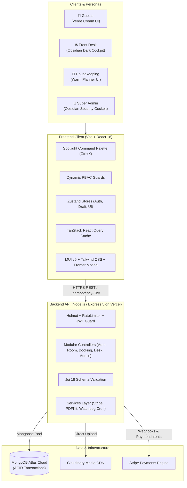

# 🏨 Grand Horizon — Luxury Hotel Management & Hospitality Operations System

[](https://hotel-management-system-six-topaz.vercel.app/)
[](https://hotel-backend-api-zeta.vercel.app/)
[](https://cloud.mongodb.com/)
[](https://react.dev/)
[](https://jestjs.io/)
[](https://playwright.dev/)

> An enterprise-grade, end-to-end Hotel Management & Hospitality Operations platform built on the modern MERN stack. Designed to eliminate operational friction by unifying luxury guest booking journeys, real-time front desk flight operations, housekeeping turnover boards, and managerial governance into a single cohesive operating system.

---

## 🌐 Live System URLs

| Subsystem | Live Production URL | Notes |
| :--- | :--- | :--- |
| **🏨 Frontend Web Application** | [hotel-management-system-six-topaz.vercel.app](https://hotel-management-system-six-topaz.vercel.app/) | Public catalog, guest portal & staff consoles |
| **⚙️ Backend REST API** | [hotel-backend-api-zeta.vercel.app](https://hotel-backend-api-zeta.vercel.app/) | Serverless Express API on Vercel |
| **🩺 Health Check Probe** | [hotel-backend-api-zeta.vercel.app/health](https://hotel-backend-api-zeta.vercel.app/health) | Uptime & system monitoring probe |
| **📖 Interactive API Docs** | [hotel-backend-api-zeta.vercel.app/api-docs](https://hotel-backend-api-zeta.vercel.app/api-docs) | Interactive Swagger / OpenAPI 3.0 explorer |

---

## 👥 Supported Operational Personas

The system architecture implements strict PBAC boundaries across four distinct enterprise personas:

| Persona | Role Scope & Primary Panels |
| :--- | :--- |
| **👑 Super Admin** | Full PBAC Matrix, Revenue Analytics, Immutable Audit Logs, Staff Administration |
| **🛎️ Front Desk Staff** | Flight-Ops Cockpit, Walk-in Booking, Arrivals/Departures, Keycards, Cash Settlement |
| **🧹 Housekeeping Lead** | Cleanliness Board, Dirty ➔ Clean transitions, VIP Room Flagging |
| **👤 Guest** | Public Suite Discovery, Reservation Flow, Guest Portal, Stay History, PDF Invoices |

> *Security Notice: Production administrative credentials are restricted and provided privately upon authorized request. Local development seed accounts can be generated via `npm run seed`.*

---

## 🏛️ System Architecture



---

## ✨ Core Pillars & Architectural Decisions

1. **Zero Double-Booking Guarantee (ACID Transactions):**
   - High-concurrency room reservations are wrapped inside MongoDB transactional sessions (`session.startTransaction`).
   - If two guests attempt to book the exact same suite concurrently, isolation locks guarantee that one succeeds (201 Created) while the other receives a conflict rejection (409 Conflict) with zero double-bookings.

2. **Dynamic PBAC (Permission-Based Access Control) Matrix:**
   - 15+ micro-permissions (`bookings:view`, `payments:recordCash`, `housekeeping:update`, `audit:view`, `analytics:view`, etc.).
   - Permission guarding is enforced in dual layers:
     - **Frontend:** Unauthorized buttons, tabs, and routes are cleanly omitted from the DOM via `<Can>` wrappers.
     - **Backend:** Express middleware (`requirePermission`) intercepts unauthorized requests and issues HTTP 403 Forbidden.

3. **Zero Optimistic UI:**
   - All critical staff operations (check-in, walk-in creation, keycard reissuance, housekeeping transitions, cash recordings) require server-authoritative receipts before updating local state, preventing desynchronized workflows.

4. **15-Minute Watchdog Cron Service:**
   - An automated background worker monitors unpaid draft reservations and automatically releases locked room inventory after 15 minutes.

5. **Spotlight Command Palette (`Ctrl+K` / `Cmd+K`):**
   - Global keyboard launcher providing instant jump navigation across rooms, bookings, staff directories, and administrative modals in under 2 keystrokes.

6. **Cryptographically Verifiable Audit Logs:**
   - Append-only log recording actor ID, action type, target ID, payload delta diff, client IP, and UTC timestamp for forensic compliance.

---

## 🚀 Operational Domain Walkthrough

### 1. Public Discovery & Guest Experience Portal
- **Suite Showcase:** 9+ bespoke luxury suites and presidential estates with high-definition photography and curated amenity badges.
- **Real-Time Availability Engine:** Dynamic date range picker with capacity and tier filtering.
- **Checkout & Multi-Discount Coupons:** Atomic multi-room reservation supporting promo codes (`WELCOME10`, `SUMMER20`, `VIP50`) and Stripe card processing.
- **Idempotency Protection:** Prevents duplicate charges via `Idempotency-Key` headers.
- **Guest Dashboard (`/dashboard`):** View stay history, download instant official PDF invoices, request tiered policy cancellations, and manage favorites.

### 2. Front Desk Flight-Ops Cockpit (`/desk`)
- **30-Second Walk-In Reservation:** Rapid reservation dialog for on-site arrivals with immediate suite assignment.
- **Arrivals & Departures Roster:** Real-time checklist of daily guest arrivals and scheduled departures.
- **Keycard Management:** Digital NFC keycard issuance and re-issue counter.
- **Settlement Enforcement:** Prevents guest check-out if outstanding balance exceeds $0.00.

### 3. Housekeeping Cleanliness Kanban Board (`/housekeeping`)
- **4-State Interactive Kanban:** Real-time drag-and-drop or click transitions (`Dirty` ➔ `Cleaning` ➔ `Clean` ➔ `Maintenance`).
- **Automated Workflow Linkage:** Front desk check-outs automatically flip suites to `Dirty`.
- **VIP Room Highlighting:** Visual priority indicators for suites with imminent high-tier arrivals.

### 4. Super-Admin & Governance Console (`/admin`)
- **PBAC Matrix Page:** Interactive role-permission matrix allowing instant permission toggles per employee.
- **Executive Performance Analytics:** Real-time KPI cards for Gross Revenue, Occupancy Rate (%), ADR (Average Daily Rate), and RevPAR powered by MUI X-Charts.
- **Audit Observability (`/admin/audit-logs`):** Searchable, paginated trail of every administrative mutation.
- **Review Moderation (`/admin/reviews`):** Quarantine and approve guest reviews before public display.

---

## 🛠️ Complete Technology Stack

### Frontend
- **Core:** React 18.3, Vite (Custom ESM Bundler & Chunk Splitting)
- **UI Frameworks:** Material UI (MUI v5) custom theme + Tailwind CSS + Framer Motion
- **State Management:** Zustand (Auth, Booking Draft, UI state stores)
- **Data Fetching:** TanStack React Query v5 (Optimistic caching, background refetching)
- **Routing & Guards:** React Router DOM v6 + Dynamic `<Can>` authorization wrappers
- **Forms & Validation:** React Hook Form + Zod & Joi validation schemas
- **Icons & Visualization:** Lucide React, MUI X-Charts, MUI X-Data-Grid

### Backend
- **Runtime & Framework:** Node.js LTS v20, Express.js 5 (RESTful Controller-Service pattern)
- **Serverless Hosting:** Vercel Serverless Functions with Mongoose connection pool caching
- **Database:** MongoDB Atlas (Cloud M0 Replica Set with ACID transaction sessions)
- **ORM & Data Layer:** Mongoose v8 (Static helpers, compound indices, soft-deletes)
- **Validation:** Joi v18 (Strict query, param, and body validation)
- **Security:** Helmet, Sliding-window rate limiters, CORS whitelisting, Bcrypt password hashing
- **Authentication:** JWT (15-min Access Tokens + 7-day Refresh Tokens + Rotation)
- **Logging:** Winston structured multi-transport logging + Morgan HTTP stream
- **Payments & Media:** Stripe PaymentIntents API, Cloudinary Asset CDN
- **Invoicing:** PDFKit server-side invoice generation

---

## 📂 Repository Directory Layout

```
Hotel-Management-System/
├── backend/
│   ├── api/index.js                 # Vercel Serverless Express bootstrap handler
│   ├── src/
│   │   ├── config/                  # DB connection pool, environment, constants, swagger
│   │   ├── controllers/             # Auth, Room, Booking, Desk, Admin, Engagement, Chat
│   │   ├── middlewares/             # PBAC, JWT auth, Joi validation, RateLimiter, ErrorHandler
│   │   ├── models/                  # User, Room, Booking, Payment, AuditLog, Review, Coupon
│   │   ├── routes/                  # Express route definitions
│   │   ├── services/                # Business logic, Stripe integration, PDF generation, Cron
│   │   └── utils/                   # ApiError, ApiResponse, Logger, Email helper
│   ├── tests/                       # Jest unit & integration test suites (146 tests)
│   └── vercel.json                  # Serverless route rewrites
├── frontend/
│   ├── src/
│   │   ├── components/              # Admin, Desk, Housekeeping, Guest, Common components
│   │   ├── layouts/                 # StaffLayout, GuestLayout, HousekeepingLayout
│   │   ├── pages/                   # Public, Desk, Housekeeping, Admin pages
│   │   ├── services/                # Axios API services with interceptors & idempotency
│   │   ├── stores/                  # Zustand auth, draft, and UI state stores
│   │   └── config/                  # Custom Obsidian Dark & Verde Cream themes
│   └── vercel.json                  # SPA routing and backend proxy rewrites
├── diagrams/                        # Standalone interactive architecture & sequence diagrams
├── postman/                         # Complete Postman API collection & environment
├── PROJECT_PORTFOLIO_EXECUTIVE_SUMMARY.docx  # Formatted Word presentation document
├── PROJECT_PORTFOLIO_EXECUTIVE_SUMMARY.txt   # Plaintext portfolio summary
└── package.json                     # Root workspace configuration
```

---

## 🧪 Testing & Quality Assurance

The codebase was validated through rigorous multi-persona testing:

- **146 Automated Tests Passing:** Complete Jest test suite covering authentication, concurrency isolation, PBAC boundaries, and rate limiting.
- **Playwright E2E Browser Suite:** Verified all 4 personas on live rendered DOM elements.
- **Production Build:** Vite frontend bundles cleanly in ~21 seconds with zero TypeScript or runtime bundle errors.

### Running Tests Locally:

```bash
# Backend Unit & Integration Tests
cd backend
npm test

# Frontend Production Build Verification
cd ../frontend
npm run build
```

---

## 💻 Local Development Setup

### 1. Clone Repository:
```bash
git clone https://github.com/Mhamza159/Hotel-Management-System.git
cd Hotel-Management-System
```

### 2. Configure Backend:
```bash
cd backend
cp .env.example .env
# Fill in your MONGO_URI, JWT_SECRET, STRIPE_SECRET_KEY, etc.
npm install
npm run seed     # Seeds demo rooms, users, coupons
npm run dev      # Starts server on http://localhost:5000
```

### 3. Configure Frontend:
```bash
cd ../frontend
cp .env.example .env
# Set VITE_API_BASE_URL=http://localhost:5000/api/v1
npm install
npm run dev      # Starts Vite dev server on http://localhost:5173
```

---

## 👤 Author & Maintainer

**M Hamza Hakim**
- **GitHub:** [@Mhamza159](https://github.com/Mhamza159)
- **Role:** Full-Stack MERN Developer / System Architect
